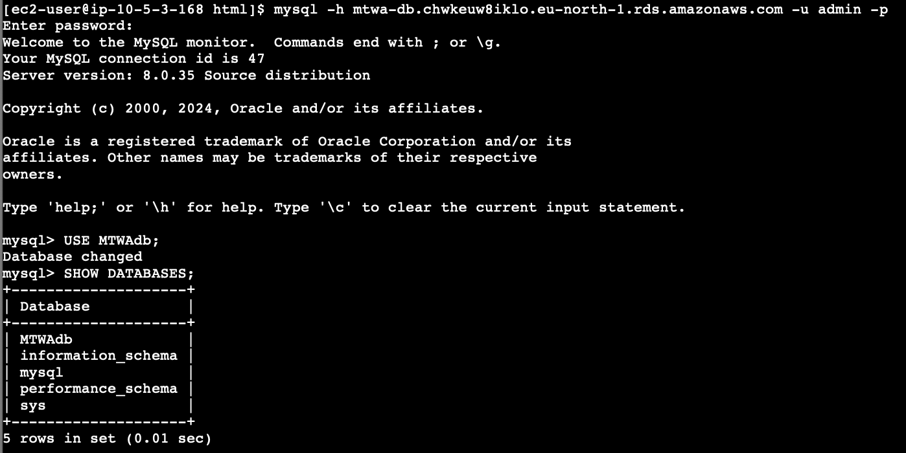
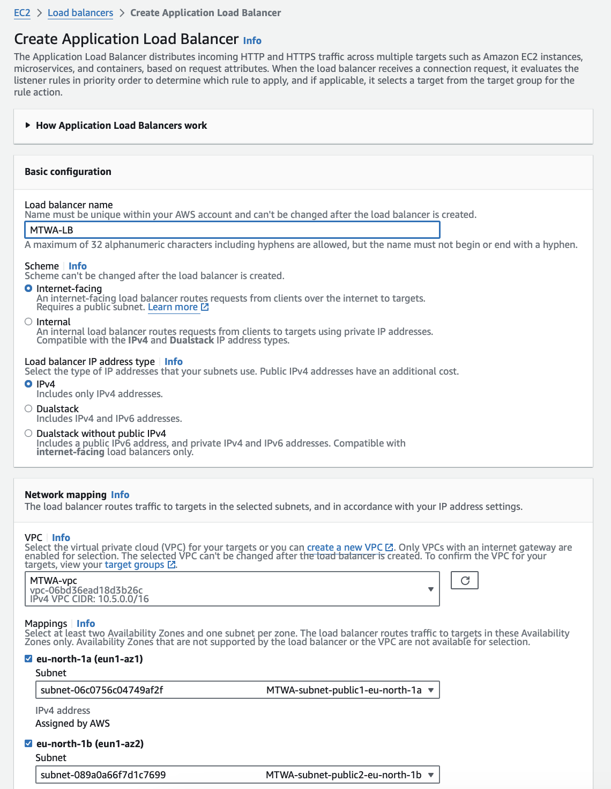
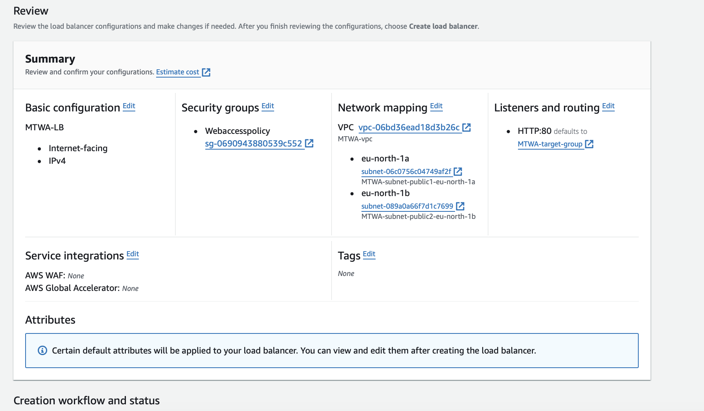
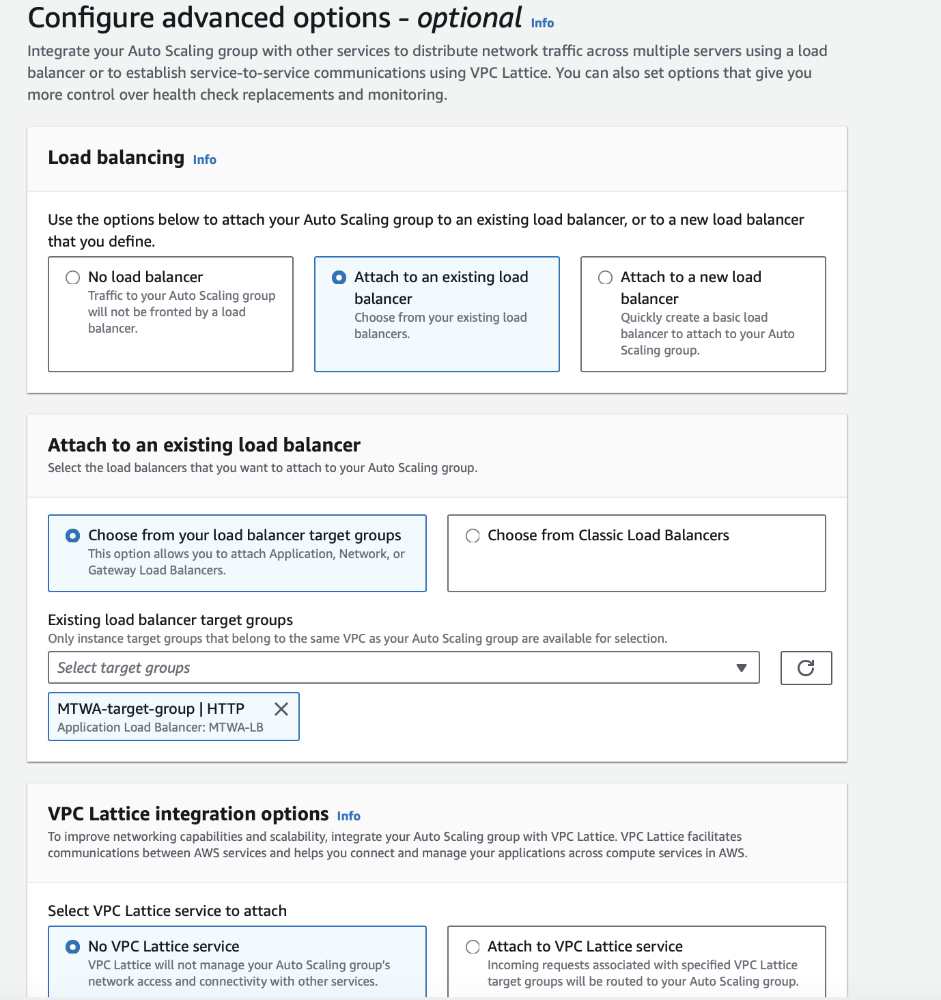
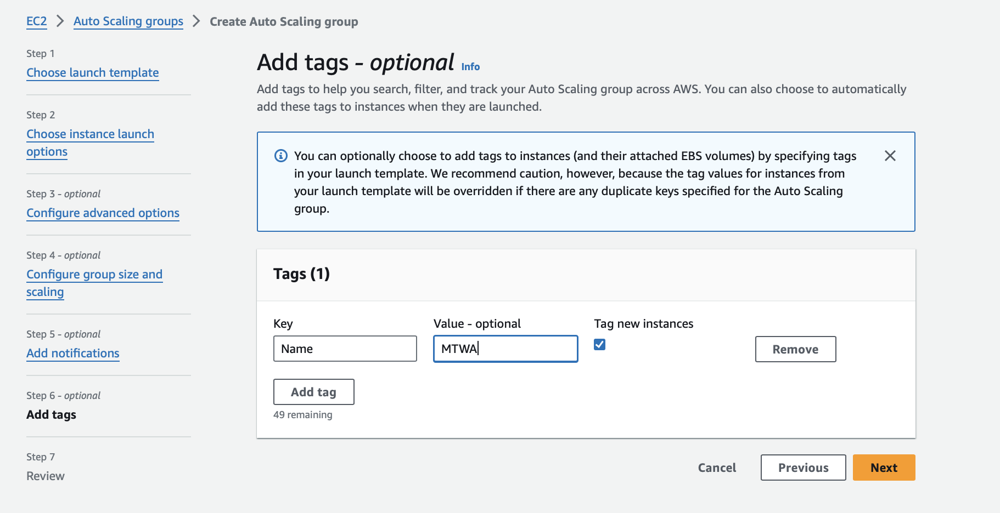

### Highly Available Multi-Tier Web Application with Auto Scaling and Load Balance on AWS

## Project Overview: 

In this project, we demonstrate the process of setting up a highly available, multi-tier web application architecture on AWS. The architecture involves creating a Virtual Private Cloud (VPC) with public and private subnets, setting up EC2 instances for the web tier, and deploying an RDS instance for the database tier. Additionally, we configure security groups, load balancing, and auto-scaling to ensure high availability and fault tolerance. The web application used in this project is a sample PHP application connected to a MySQL database.

The key components of the architecture include:

- Virtual Private Cloud (VPC): A logically isolated network for deploying AWS resources.
- Subnets: Public and private subnets for segregating web and database tiers.
- Security Groups: Firewall rules to control inbound and outbound traffic.
- EC2 Instances: Virtual servers to host the web application.
- RDS Instance: A managed MySQL database service.
- Load Balancer: Distributes incoming traffic across multiple EC2 instances.
- Auto Scaling Group: Ensures the number of EC2 instances adjusts based on demand.
- The architecture ensures high availability by distributing the load across multiple instances and automatically scaling the number of instances based on traffic.

## Prerequisites:

- An AWS account
- Basic knowledge of AWS services (VPC, EC2, RDS, etc.)
- Familiarity with Linux command line

## Architecture Diagram:


## Step-by-Step Implementation:

### Step 1 - Create VPC and Subnets Including Internet & NAT Gateway, Routing Table

- From your AWS console, navigate to the VPC Dashboard.

- In the VPC dashboard, click on Create VPC button.

- Fill in the required options as per your requirements.

- Click on Create after filling the options appropriately.


### Step 2 -  Create Web Security Group to Allow HTTP

- Navigate to the Security Groups section in the VPC dashboard.

- Click on Create security group and fill in the necessary details to allow HTTP traffic.


### Step 3 -  Create Web EC2 instance and Connect to RDS

- Launch a new EC2 instance using the previously created security group, and select the VPC created previously.


- Connect to the instance via SSH and perform the following setup:

- Update the package manager:

```
sudo yum update -y
```

- Install Apache web server:

```
sudo yum install -y httpd
```

- Start and enable Apache to start on boot:

```
sudo systemctl start httpd

sudo systemctl enable httpd
```

- Verify Apache's status:

```
sudo systemctl status httpd
```


- Install PHP and common PHP modules:

```
sudo amazon-linux-extras install -y php7.4

sudo yum install -y php php-mysqlnd php-fpm php-json
```


- Install Git and clone the PHP Dev Website repository:

```
sudo yum install git -y
```


```
git clone https://github.com/Revelation69/PHP_Dev_Website.git
```


- Copy the website content to Apache’s default website folder:

```
sudo cp -R ~/PHP_Dev_Website/html/. /var/www/html
```

- Disable Apache's default page:

```
sudo mv /etc/httpd/conf.d/welcome.conf /etc/httpd/conf.d/welcome.conf_backup
```

- Grant Apache ownership of the /var/www/html folder:

```
sudo chown -R apache:apache /var/www/html
```

- Restart Apache 

```
sudo systemctl restart httpd
```

- Verify that Apache's status is active:

```
sudo systemctl status httpd
```


### Step 3a -  Create DB security group

- Create a security group for your database to allow the necessary traffic.


###  Step 3b - Create DB Subnet group

- Create a DB Subnet Group by filling in the required details.


### Step 3c - Create AWS RDS instance

- Create a MySQL database instance on RDS.


### Step 3d - Connect to RDS Database


- Install MySQL client on your web server:

First download the RPM file

```
sudo wget https://dev.mysql.com/get/mysql80-community-release-el9-1.noarch.rpm 
```
Install the RPM file
```
sudo yum install mysql80-community-release-el9-1.noarch.rpm -y
```
Get the public key of mysql to install the software
```
sudo rpm --import https://repo.mysql.com/RPM-GPG-KEY-mysql-2023
```
Install mysql client
```
sudo yum install mysql-community-client -y
```


- Install PHP MySQLi function:

```
sudo yum install -y php-mysqli
```


The MySQLi Functions allows you to access MYSQL database servers.


- Copy your database endpoint


- Edit the PHP configuration file to update connection details in functions.php to point to your RDS instance:

```
cd /var/www/html
```

```
sudo nano functions.php
```


_Ensure you update the following details with your own information. Please note, this example is for learning purposes only and is not a best practice for real-world development. In a professional setting, you should never expose your database credentials directly in your code. Instead, use a secrets manager to store your credentials and KMS (Key Management Service) for encryption. We will cover these best practices in a future project._

- Log into the RDS database:

```
mysql -h your_rds_endpoint -u your_master_username -p
```

Enter your RDS password when prompted.

Select Your Database:

```
USE your_database_name;
```

- Create the users table in your database:

```
CREATE TABLE users (
    id INT AUTO_INCREMENT PRIMARY KEY,
    username VARCHAR(50) NOT NULL,
    email VARCHAR(100) NOT NULL,
    user_type VARCHAR(20) NOT NULL,
    password VARCHAR(255) NOT NULL,
    created_at TIMESTAMP DEFAULT CURRENT_TIMESTAMP
);
```

- Verify the table creation:

```
SHOW TABLES;
```


- Describe the users table to see its structure:

```
DESCRIBE users;

```



**Accessing the Application**

- Copy the public IP of the EC2 instance and navigate to it in your browser to access the PHP application:

```
<http://your_server_ip/register.php>
```


- After registration, you should be logged in:


- You can register another user by returning to the registration page then login:


**Confirming Database Connection**

- Log back into the database from the terminal to verify the stored user credentials:


_Your PHP application should now be successfully connected to the RDS database._

### Step 4 - Create an Amazon Machine Image (AMI) from the running EC2 instance

- Navigate to the Instances page in your AWS console.

- Select the instance you want to create an AMI from.

- Click on the Actions menu, select Images and templates, then click on Create image.


- View the newly created image by selecting AMIs from the options on the left side of the console.


### Step 5 - Create a load balancer

### 5a. Create Target Group

- From your AWS console, navigate to Target groups.

- Select Create a target group.


Note: Do not select the instance shown when creating the Target group, as that instance is only used to create our AMI and is in the public subnet. We need our instances to be in the private subnet. Uncheck the box and proceed to create the target group.

### 5b. Create Load Balancer

- From your AWS console, navigate to Load balancers.

- Click on Create Load balancer and select Application Load Balancer.







- Once created, copy your load balancer DNS name and save it.

### Step 6 - Create a launch Template and an Auto Scaling group

- Navigate to Launch Templates from your AWS console.

- Click on Create Launch Template.


- Once the launch template is created, create an Auto Scaling group.








- Confirm you have the auto-scaling instances up and running in your EC2 instance dashboard. You can now terminate the original instance created.


- Paste the load balancer DNS name into your browser to access your application. You can log in with the credentials of the users created earlier to ensure the auto-scaling instance data persists with the database.


Every time you visit the load balancer, it balances the traffic across each running instance. You can also terminate a running instance; after a few seconds, it will create another one automatically to ensure the desired state is met.

### Conclusion:

This project successfully demonstrates the implementation of a highly available, fault-tolerant multi-tier web application on AWS. By utilizing various AWS services such as EC2, RDS, VPC, Load Balancer, and Auto Scaling, we have ensured that the web application can handle varying levels of traffic and maintain high availability. This architecture not only improves the performance and reliability of the application but also provides a scalable solution that can grow with increasing demand.

With the setup completed, the web application is now robust and capable of handling user requests efficiently, ensuring that the backend database is secure and well-connected. Future improvements can include implementing additional security measures, such as using AWS Secrets Manager for database credentials and setting up CloudWatch for monitoring and alerting.

**Project Completed**